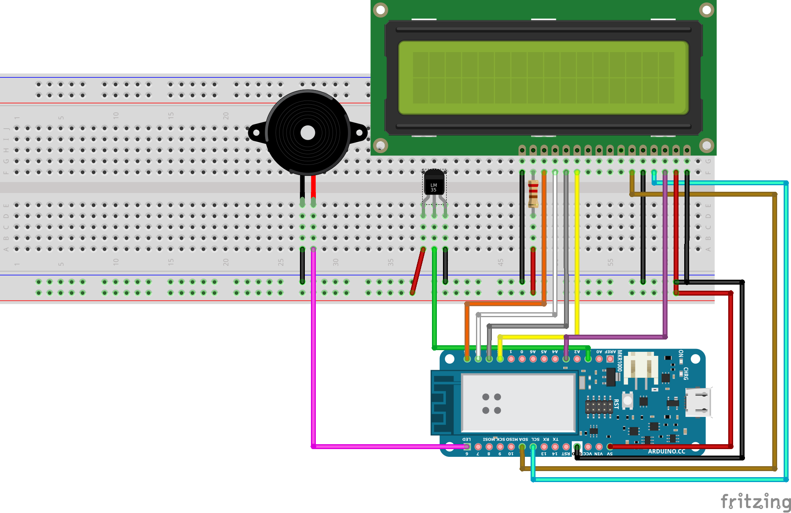

# Fireduino

An Arduino-based, cloud-enhanced system for monitoring and reporting temperatures in an environment.

## Requirements

- Arduino IDE
- Arduino MKR1000
- TMP36 Temperature Sensor
- HD44780 LCD Display
- Piezo buzzer
- 220 Ω resistor

## Setup

### Circuit

Set up the circuit like so:

There are many connections here - verify that they are correct before proceeding.

### Arduino Cloud

Set up your Arduino to use the Arduino Cloud. To do so, sign in to
[Arduino Cloud](https://cloud.arduino.cc). Go to "IoT Cloud", and under the "devices" tab, add a
device. Download and install the Arduino Create Agent and run it, and connect your Arduino to your
PC via USB. The Arduino should be detected and you can add it as a device. Proceed to create a new
"thing" under the things tab, and associate the device with it.

As far as I can tell, there is no way to import the full configuration for a "thing" into the
Arduino Cloud, so you must set the variables manually. Create 5 variables:

- *temperature*, of type **CloudTemperatureSensor**, read only, updated every 5 seconds
- *buzzer_temp_low*, of type **float**, read & write, updated on change
- *buzzer_temp_high*, of type **float**, read & write, updated on change
- *buzzer_temp_low_pitch*, of type **float**, read & write, updated on change
- *buzzer_temp_high_pitch*, of type **float**, read & write, updated on change

You can view and manipulate these variables in a dashboard.

### Uploading the Sketch

Note that this must be done *after* you have set up your device for Arduino Cloud.

The easiest way to upload the sketch is to run the provided "upload.sh" script. You may need to
change the **PORT** variable in this script to the correct port for your device. The script prompts
for the root password using sudo, as this is required to write data over the port.

You can also upload the sketch via the Arduino web editor. This requires having the Arduino Create
Agent running. To import the sketch into the web editor, you can click the import button near the
top left of the screen. It requires a zip file containing the following files:

- sketch.json
- fireduino.ino
- thingProperties.h
- arduino_secrets.h

Once this is imported, you can verify & upload the sketch to the device via the web editor. You may
be required to set the wifi ssid and password again.

## Usage

The device first takes roughly 15 seconds to fully start. This is done to work around deficiencies
in the ArduinoIoTCloud library. When fully started, you should hear a single beep from the piezo
buzzer.

The LCD display shows the current temperature reading and current date & time. The temperature is
read in degrees celsius and is updated every second. The accuracy of the temperature reading is
dependent on the temperature sensor used. The date is displayed in the format YYYY-MM-DD HH-MM. The
timezone used for the date is defined at compile time, in the UTC_OFFSET macro in the fireduino.ino
file. Redefine this to be suitable for your current timezone.

### Cloud Integration

The device reports temperature readings to the Arduino Cloud at 5 second intervals. The temperature
data is stored as a floating point number, which the Arduino cloud truncates to 2 decimal places.
To view a graph of temperature over time, the Arduino Cloud has a builtin chart display in the
Dashboard section, which you can use to display the temperature readings over time.

There are 4 variables (reaching the limit of what is allowed with a free Arduino Cloud account)
that control the behaviour of the piezo buzzer in response to the temperature readings.
*buzzer_temp_low* and *buzzer_temp_high* set the temperature thresholds for the "low temperature"
and "high temperature" piezo buzzer warnings. If the high temperature threshold is lower than the
low temperature threshold, the high temperature warning takes priority. The variables
*buzzer_temp_low_pitch* and *buzzer_temp_high_pitch* control the frequency of the piezo buzzer for
their respective temperature warnings. Note that values lower than 32hz are unlikely to work.

### Serial Monitor

The device also outputs information over the serial port. The current temperature reading and
current time are logged each second to serial output. Additionally, information about WiFi and
Arduino Cloud connection status is output at startup.

## Development

The ArduinoIoTCloud library is really bad. It really just... *sucks*. While developing this I
encountered many strange and frustrating behaviours caused by this library. For instance, the
library connects to WiFi itself. This forbids you from using any other WiFi library, and forces use
of the built in one. The ArduinoCloud.begin() function connects to the cloud *asynchronously*,
which isn't a problem on its own, but does introduce some design considerations. For example, I had
to connect to an NTP server to synchronize the Arduino's RTC. This meant waiting for the WiFi
connection to be established, which requires polling the ArduinoCloud.connected() function in a
busy loop before continuing. Immediately proceeding after connecting to the cloud proved
problematic - for some ungodly reason, doing this would cause the ArduinoCloud.update() function to
completely hang later in the programs execution. The library is completely opaque, and nothing I
did seemed to affect it. I was able to "fix" this by introducing a 10 second delay *after*
connecting to WiFi. God only knows why this works. But wait, there's more! With this newfound long
startup time, I wanted to show a message on the LCD screen to say "Connecting", and maybe play a
little loading animation. ArduinoIoTCloud decided against that. It turns out that initializing the
LCD before calling ArduinoCloud.begin() would, again, just completely break it. The LCD would
initialize fine, and the message would display perfectly - but as soon as you called
ArduinoCloud.begin(), chaos would ensue. *Somehow* the ArduinoCloud library would write garbage
characters to the screen, and any further attempts to print to the screen wouldn't work. Then, just
as before, the ArduinoCloud.update() function would completely hang, with no output whatsoever. I
have absoluetly no idea how a library can be so poorly written that it just steps all over the
memory of another, but it seemed like that was what was happening. I found no fix for this, and
decided to just leave the LCD blank until after we connected.
