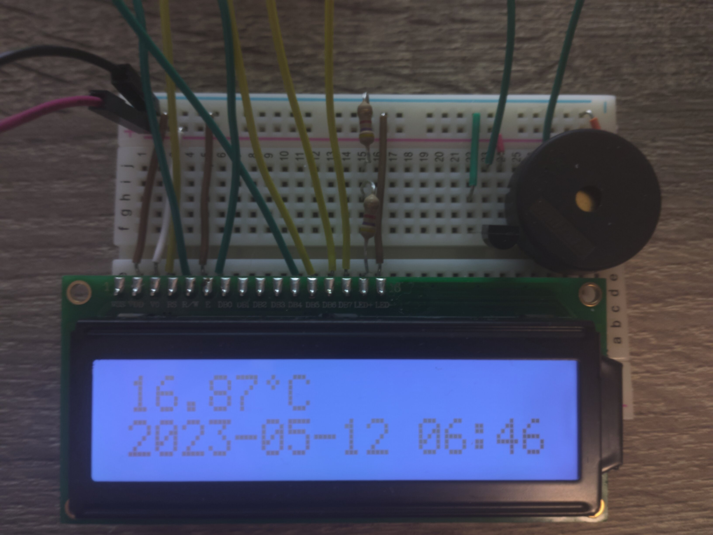
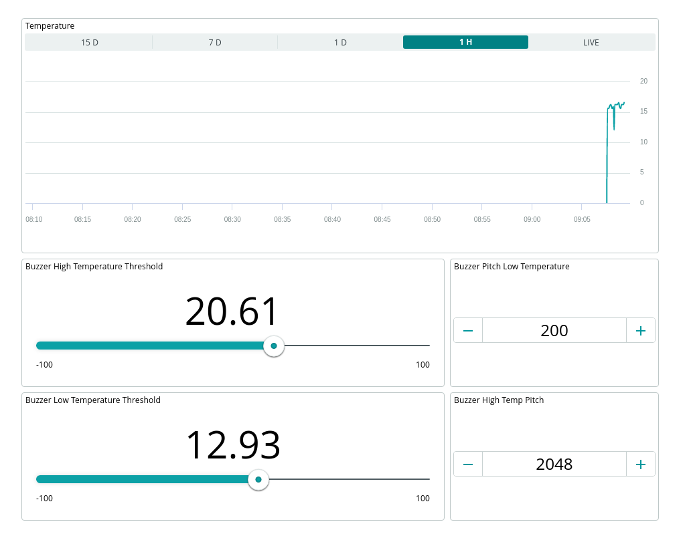
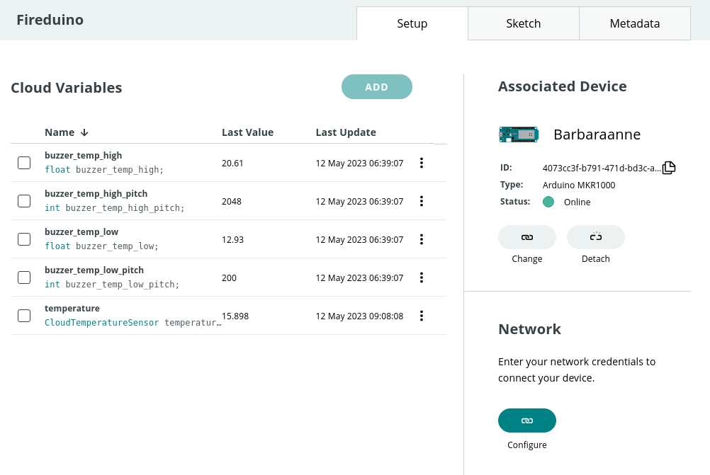

# Usage

The device first takes roughly 15 seconds to fully start. This is done to work around deficiencies
in the ArduinoIoTCloud library. When fully started, you should hear a single beep from the piezo
buzzer.

The LCD display shows the current temperature reading and current date & time. The temperature is
read in degrees celsius and is updated every second. The accuracy of the temperature reading is
dependent on the temperature sensor used. The date is displayed in the format YYYY-MM-DD HH-MM. The
timezone used for the date is defined at compile time, in the UTC_OFFSET macro in the fireduino.ino
file. Redefine this to be suitable for your current timezone.

## Cloud Integration

The device reports temperature readings to the Arduino Cloud at 5 second intervals. The temperature
data is stored as a floating point number, which the Arduino cloud truncates to 2 decimal places.
To view a graph of temperature over time, the Arduino Cloud has a builtin chart display in the
Dashboard section, which you can use to display the temperature readings over time.

There are 4 variables (reaching the limit of what is allowed with a free Arduino Cloud account)
that control the behaviour of the piezo buzzer in response to the temperature readings.
*buzzer_temp_low* and *buzzer_temp_high* set the temperature thresholds for the "low temperature"
and "high temperature" piezo buzzer warnings. If the high temperature threshold is lower than the
low temperature threshold, the high temperature warning takes priority. The variables
*buzzer_temp_low_pitch* and *buzzer_temp_high_pitch* control the frequency of the piezo buzzer for
their respective temperature warnings. Note that values lower than 32hz are unlikely to work.

## Serial Monitor

The device also outputs information over the serial port. The current temperature reading and
current time are logged each second to serial output. Additionally, information about WiFi and
Arduino Cloud connection status is output at startup.

